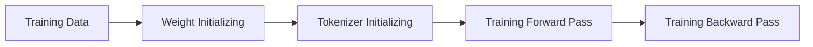

Outline:
- [LLM Essential](#llm-essential)
- [LLM Fine-tune](#llm-fine-tune)
- [LLM Distillation](#llm-distillation)
- [Agent Framework](#agent-framework)
- [Data Flywheel](#data-flywheel)

***

## LLM Essential
GPT Training Process  ([State of GPT](https://karpathy.ai/))



1. **Training Data**  

   - Raw data of base model's training 
     - [Common Crawl](https://commoncrawl.org/)
     - C4/C4.EN (from April 2019 snapshot of Common Crawl)
     - Github/Wikipedia/ArXiv/Stack Exchange
     - Books 1/2/3(digital books with undeclared source)
      
   - Training Data of SFT model
    - Prepared manually by people
   - Training Data of RW model
    - Prepared manually by people     
  <br>
2. **Weights initializing**
    - FFN
      - Xavier/Glorot
      - Kaiming/He
    - Q/K/V/O
      - Xavier/Glorot
      - Kaiming/He
    - Bias
      - normally initial as 0
    - LayerNorm
      - γ as 1 and β as 0
    - Token & Position embedding
      - N(0,1)
    - LM Head
      - Xavier/Glorot/Kaiming
      - or shared with embedding   
   <br> 
3. **Tokenizer initializing**
    - Algorithm  
      - BPE ([Byte-pair encoding](https://github.com/tpn/pdfs/blob/master/A%20New%20Algorithm%20for%20Data%20Compression%20(1994).pdf))  
        ```mermaid
          graph LR
              A[a b c d b c d] --> B["`a **X** d **X** d`"] --> C["`a **Y**`"]
        ```
        > Above letters are sampled for illustrating, actually in they're maybe unicode bytes.  
        "a bcd" are the final 2 tokens, and "bcd" may be added to the vocabulary.  
      - BBPE ([Byte-level BPE](https://arxiv.org/abs/1909.03341))  
        ```mermaid
          graph LR
              A["`1 UTF-8 byte
              e.g. B8`"] --> B["8 Bit => 
              1 0 1 1 1 0 0 0"] --> C["`0/1 of each bit =>
              2<sup>8</sup> = 256 possible byte values`"] --> D["`Decimal format for calculation
              e.g. 184`"]
        ```
        > Initial vocabulary only have these 256 basic bytes.  
          Need to transfer the text to NTF-8 byte firstly, then implement BPE for vocabulary iteration and tokenization.  

      - WordPiece ([Paper](https://arxiv.org/abs/1810.04805))  
        ```mermaid
            graph LR
                A["`low → l, ##o, ##w
                lower → l, ##o, ##w, ##e, ##r`"] --> B["Use below formula to calculate each pair"] --> C["`low → l, ##o, ##w
                lower → l, ##o, ##w, **##er**`"] --> D["`Vocab:
                subword(##er, ##ing etc.)
                `"]
          ```

        > $$\text{score}(a, b) = \frac{\text{freq}(a, b)}{\text{freq}(a) \times \text{freq}(b)}$$
        
          > Used in BERT (Encoder Only).  
          Advantage in search / RAG /Edge LLM(Size is smaller)   
      - Unigram
        ```mermaid
            graph LR
                A["`all letters + certain subwords from raw data =>

                initial big voca (>100k)`"] --> B["`$$p(x)=\frac{freq(x)}{freq(x)+...+freq(n)} $$`"] --> C["`low → l, ##o, ##w
                lower → l, ##o, ##w, **##er**`"] --> D["`Vocab:
                subword(##er, ##ing etc.)
                `"]
          ```

    - Vocabulary  
      - Training Data(subset of Raw data of base model training)
      - Base of vocabulary
        - BBPE -> all possible 256 UFT-8 byte values
        - BPE ->  Unicode of alphabet,numbers etc. from Raw data
      - Increment via BAE(Iteration to add each most frequent subword to the vocabulary)
      - Typical vocabulary size: LLaMA(~32K-100K ?) / Deepseek(~65K-250K?)
    - Normalizer  
      > Perform Unicode normalization (such as NFKC), case conversion, deduplication, or special symbol cleaning to ensure consistent formatting of input text
    - Pre-tokenizer
        > Perform preliminary segmentation (such as segmentation by space or byte level) before the intervention of the algorithm model to define the basic processing unit
    - Post-processor
        > Add special markers (such as [CLS], [SEP], <bos>, <eos>) and construct attention masks or paragraph type IDs to adapt to the Transformer input format
    - Decoder
        > Define the inverse rules for restoring original text from Token ID (such as byte-level decoding, removing prefix spaces), which are only necessary during the inference phase but need to be configured along with the trainer
    - Special Token Map
        > Explicitly register reserved tokens such as "<pad>" and their corresponding IDs to ensure that the model can recognize boundaries and unknown words, and align them with the dimension of the model's embedding layer
    - Tool
      - SentencePiece  
 <br> 
1. **Training Forward Pass**
    - Tokenization
    - Transformer  
    <!-- <a id="section2"></a>   -->
        - Encoder  
          1. data input & embedding
          2. positional encoding
          3. multi-head attention
          4. add & normalize
          5. feed forward neural network
          6. add & normalize
          7. multiple encoder
        - Decoder  
          1. outputs
          2. output embedding
          3.  positional encoding
          4.  masked multi-head attention
          5.  add & normalize
          6.  multi-head attention
          7.  add & normalize
          8.  feed forward neural network
          9.  add & normalize

    - Linear & Softmax
    - Output probabilities  
  <br>

1. **Training Backward Pass**  
    - cross-entropy Loss computation  
        - logits --> softmax/sigmoid --> cross-entropy

        > $$ L(y, \hat{y}) = - \frac{1}{N} \sum_{i=1}^{N} \left[ y_i \log(\hat{y}_i) + (1 - y_i) \log(1 - \hat{y}_i) \right] $$

    - Gradient computation
        > $$ \nabla L = [\frac{\partial L}{\partial w_1} + \frac{\partial L}{\partial w_2} +..... \frac{\partial L}{\partial w_n}] $$

    - Weight update by Adam
        > $$ W_n = W_o - η*\nabla L(W_o) $$     
  
  <br>  


<!-- [](https://chriszhu2050.github.io/images/1.png) -->
<!--  -->
<br>

## LLM Fine-tune  
***
## LLM Distillation  
***
## Agent Framework  
***

## Data Flywheel
***

