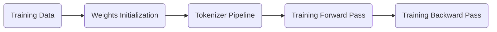

  
***  
  
GPT Training Process via Transformer ([State of GPT](https://karpathy.ai/))           [[>>>>]](/docs/llm-fine-tune/#whereami)

***  
## Glance
- Learnable weights that only one in a model:

    | Component | Weight | Shape | 
    |:----:|:----:|:----:|
    | Token Embedding | $W_E$ | [voca, d] |
    | Final RMSNorm | $γ_{final}$ | [d]|
    | LM Head | $W_{LM}$| [voca, d] |
 

- Learnable weights that one per layer ( N layers )  

    | Component | Weight | Shape | 
    |:----:|:----:|:----:|
    | RMSNorm1 | $γ_1$ | [d] |
    | Attention | $W_Q$ | [d, d]|
    | Attention | $W_K$ | [d, d] |
    | Attention | $W_V$ | [d, d] |
    | Attention | $W_O$ | [d, d] |
    | RMSNorm2  | $γ_2$| [d] |
    | SwiGLU | $W_{gate}$| [d, $d_{ff}$] |
    | SwiGLU | $W_{up}$| [d, $d_{ff}$] |
    | SwiGLU | $W_{down}$| [$d_{ff}$, d] |
    

