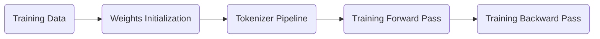

  
***  
  
GPT Training Process via Transformer ([State of GPT](https://karpathy.ai/))           [[>>]](/docs/llm-essential-backward-pass/#whereami)

```mermaid

graph LR
    A(Training Data) --> B(Weights Initialization) --> C(Tokenizer Pipeline) --> D(Training Forward Pass) --> E(Training Backward Pass)
    click A "#training-data"
    click B "#weights-initialization"
    click C "/docs/llm-essential-tokenizer-pipeline/"
    click D "/docs/llm-essential-forward-pass/"
    click E "/docs/llm-essential-backward-pass/"
```     

***  
  

