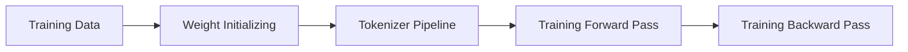

Outline:
- [LLM Essential](/)
- [LLM Fine-tune](docs/llm-fine-tune.md)
- [LLM Distillation](docs/llm-distillation.md)
- [Agent Framework](docs/agent-framework.md)
- [Data Flywheel](docs/data-flywheel.md)  
<br>

GPT Training Process  ([State of GPT](https://karpathy.ai/))


<br>  

### Training Data

***
   - Raw data of base model's training 
     - [Common Crawl](https://commoncrawl.org/)
     - C4/C4.EN (from April 2019 snapshot of Common Crawl)
     - Github/Wikipedia/ArXiv/Stack Exchange
     - Books 1/2/3(digital books with undeclared source)
      
   - Training Data of SFT model
       - Prepared manually by people
   - Training Data of RW model
      - Prepared manually by people     
  <br>

### Weights initializing of Transformer

***
  - FFN (Feed Forward Network)
    - This contains two linear transformations with a ReLU activation in between.
      - Xavier/Glorot
      - Kaiming/He
  - Q/K/V/O
    - Xavier/Glorot
    - Kaiming/He
  - Bias
    - normally initial as 0
  - LayerNorm
    - γ as 1 and β as 0
  - Token & Position embedding
    - N(0,1)
  - LM Head
    - Xavier/Glorot/Kaiming
    - or shared with embedding   
   <br> 
   
### Tokenizer Pipeline 

***    
  1. Normalizer    
      Perform Unicode normalization,  deduplication, or special symbol cleaning to ensure consistent formatting of input text

      ```mermaid
        quadrantChart
          title 4 methods of unicode normalization
          x-axis Decomposition --> Composition
          y-axis "Canonical" --> "Compatibility(Aggressive)"
              quadrant-1 "(e.g. fi → fi / ① → 1)"
              quadrant-2 "(e.g. fi → f+i / ① → 1)"
              quadrant-3 "(e.g. é → e + ́ )"
              quadrant-4 "(e.g. e + ́ → é)"
          "NFKD": [0.25, 0.8]
          "NFKC": [0.75, 0.8]
          "NFD": [0.25, 0.25]
          "NFC": [0.75, 0.25]
      
      ```
          NFC: Normalization Form Canonical Composition  
          NFD: Normalization Form Canonical Decomposition  
          NFKC: Normalization Form Compatibility Composition (used by LLM training)  <==   
          NFKD: Normalization Form Compatibility Decomposition  

      Normally LLM training was not performing the most aggressive normalize because it cause the meaning losing on letters  
    <br>

  2. Pre-tokenizer  
      It's for transferring the corpus to initial chunks for calculating token.  

      Regex-based pre-tokenization (GPT used), Ġ present the space:   
        ```mermaid
            graph LR
                A["`I'm learning AI!`"] --> B["`I
                'm
                Ġlearning
                ĠAI
                !`"] 
        ```

      <br>
      SentencePiece's pre-tokenizer, ▁ present the space: 
      
      ```mermaid
            graph LR
                A["`Hello world`"] --> B["`▁Hello ▁world`"] 
      ```
      <br>

      Byte-level transferring: 
      ```mermaid
            graph LR
                A["`Chinese: 中`"] --> B["`UTF-8: E4 BD A0`"] 
      ```   
    <br>

  3. Subword Algorithm  

      - BPE ([Byte-pair encoding](https://github.com/tpn/pdfs/blob/master/A%20New%20Algorithm%20for%20Data%20Compression%20(1994).pdf))  
        ```mermaid
          graph LR
              A[a b c d b c d] --> B["`a **X** d **X** d`"] --> C["`a **Y**`"]
        ```
        > Above letters are for illustrating, they're maybe unicode bytes in reality.  
        "a bcd" are the final 2 tokens, and "bcd" will be added to the vocabulary with token id.  
      - BBPE ([Byte-level BPE](https://arxiv.org/abs/1909.03341))  
        ```mermaid
          graph LR
              A["`UTF-8 byte
              e.g. B8`"] --> B["8 Bit => 
              1 0 1 1 1 0 0 0"] --> C["`0/1 of each bit =>
              2<sup>8</sup> = 256 possible byte values`"] --> D["`Decimal/Hex just for reading more easier
              e.g. 10111000 => 184 => B8`"]
        ```
        > Initial vocabulary only have these 256 basic bytes.  
          Need to transfer the text to NTF-8 byte firstly, then implement BPE for vocabulary iteration and tokenization.  

      - WordPiece ([Paper](https://arxiv.org/abs/1810.04805))  
        ```mermaid
            graph LR
                A["`low → l, ##o, ##w
                lower → l, ##o, ##w, ##e, ##r`"] --> B["Use below formula to calculate each pair"] --> C["`low → l, ##o, ##w
                lower → l, ##o, ##w, **##er**`"] --> D["`Vocab:
                subword(low, ##er, ##ing etc.)
                `"]
          ```

        > $$\text{score}(a, b) = \frac{\text{freq}(a, b)}{\text{freq}(a) \times \text{freq}(b)}$$
        
          > Used in BERT (Encoder Only).  
          Advantage in search / RAG /Edge LLM(Size is smaller)   
      - Unigram ([Paper](https://arxiv.org/abs/1808.06226))
        ```mermaid
            graph LR
                A["`voca (>100k)=>
                letters + subwords

                `"] --> B["` p(x)= $$\frac{freq(x)}{freq(x)+...+freq(n)} $$`"] --> C["`  
                $$ \mathbb{E}[\text{count}(x)] $$ and recalculate the p(x) 
              
                `"] --> D["`loss(x)  and  maximum $$ \mathcal{L} = \sum_{S \in \mathcal{D}} \log P(S) $$
                `"]
          ```
          > It proceed from result(raw data) to reason(voca+probability) with big initial vocabulary.  
          Vocabulary pruning will be done with ME iteration and loss calculation.  
    <br>
    
  4. Vocabulary  

      - Training Data  
        Subset of Raw data of base model training(e.g. BookCorpus, Wikipedia)
    
      - BBPE(Byte-level BPE)  
        initialized with all possible 256 UFT-8 byte values and finalized with frequent bytes pair and so on

        | TokenID | Byte | Hex | Comments |
        |:----:|:----:|:----:|:----:|
        | 0 | 0 | 00 | byte 0 |
        | 1 | 1 | 01 | byte 1 |
        | ... | ... | ... | ... |
        | 255 | 255 | FF | byte FF |

      - BPE   
        Initialized with characters, numbers and so on from Raw data   

      - WordPiece  
        Initialized with basic letters and finalized with characters with/without **##**, numbers and so on from Raw data

        | TokenID | Character |
        |:----:|:----:|
        | 0 | play |
        | 1 | ##ing |
        | 2 | ##er|
        | ... | ... |
        | 30522| ##able |

      - Unigram  
          Initialized with big vocabulary(>100k) and prune to target size(e.g. ~30k)
          Specific letter to indicate space:
        **▁This ▁is ▁a ▁tokenizer** 

        | TokenID | Character |
          |:----:|:----:|
          | 0 | ▁This |
          | 1 | This |
          | 2 | Th|
          | ... | ... |
          | 500001| ▁tokenizer |  
    <br>

  5. Post-processor  
      
        - Add structural mark to the token sequence (such as `<bos>`, `<eos>`)
    
        - Add Chat Template mark likes `<|user|>`、`<|assistant|>`    
    
          | TokenID | Special mark |
          |:----:|:----:|
          | 111 | `<bos>` |
          | 112 | `<eos>` |
          | 113 | `<\|user\|>`|
          | 114 | `<\|assistant\|>`|
          | ... | ... |
  
          ```mermaid
            graph LR
                A["`BBPE
                [e4 bd a0,  e5 a5 bd]`"] --> B["Post-processor
                [ e4 bd a0,  e5 a5 bd, < bos >]
                "] --> C["`Token ID Mapping`"] 
          ```
          Post-processor may also happen after the Token ID Mapping, depends on different mechanism of models     
    <br>

  6. Token ID Mapping  

      ```mermaid
          graph LR
              A["`Token`"] --> B["`Vocabulary`"] --> C["`Token ID`"] --> D["`Transformer`"] 
      ```  
    <br>
  7. Tokenizer Toolkit  
      - [SentencePiece](https://github.com/google/sentencepiece)
      - [HuggingFace Tokenizers](https://github.com/huggingface/tokenizers) 
      - [tiktoken](https://github.com/openai/tiktoken)
    
    
      ```mermaid
          kanban
          [Tokenization Toolkit]
              [Normalizer]
              [Pre-tokenizer]
              [Subword Trainer / Algorithm]
              [Vocabulary]
              [Post Processor]
              [Token-ID mapping]
      ```  
    <br> 

  8. Popular models' tokenizer and vocabulary info  

      | Model | Company | Tokenizer | Vocabulary Size | Comments |
      |:----:|:----:|:----:|:----:|:----:|
      | GPT-4o | OpenAI | tiktoken | ~199,998 | [>> link](https://github.com/tryAGI/Tiktoken/blob/main/data/README.md?utm_source=chatgpt.com) |
      | Mixtral| Mistral AI | SentencePiece | ~32,000 | ?|
      | LLaMA 3| Meta | tiktoken-based | ~128,256 | [>> link](https://github.com/meta-llama/llama-models/blob/main/README.md?utm_source=chatgpt.com) |
      | Qwen3| Alibaba | HuggingFace Tokenizers | ~151,669 | [>> link](https://github.com/QwenLM/Qwen3/blob/main/docs/source/getting_started/concepts.md?utm_source=chatgpt.com) |
      | DeepSeek-V3| DeepSeek | SentencePiece/HF compatible implementation | ~128,000 | [>> link](https://arxiv.org/abs/2412.19437?utm_source=chatgpt.com) |

    <br> 

### Training Forward Pass

***
  - Tokenization  
  
    ```mermaid
            graph LR
                A["`Raw Data`"] --> B["`Tokenizer`"] --> C["`Transformer`"] 
    ```


  - Transformer  
  <!-- <a id="section2"></a>   -->
      - Encoder  
        1. data input & embedding
        2. positional encoding
        3. multi-head attention
        4. add & normalize
        5. feed forward neural network
        6. add & normalize
        7. multiple encoder
      - Decoder  
        1. outputs
        2. output embedding
        3.  positional encoding
        4.  masked multi-head attention
        5.  add & normalize
        6.  multi-head attention
        7.  add & normalize
        8.  feed forward neural network
        9.  add & normalize

  - Linear & Softmax
  - Output probabilities  
<br>

### Training Backward Pass  

***  
  - cross-entropy Loss computation  
      - logits --> softmax/sigmoid --> cross-entropy

      > $$ L(y, \hat{y}) = - \frac{1}{N} \sum_{i=1}^{N} \left[ y_i \log(\hat{y}_i) + (1 - y_i) \log(1 - \hat{y}_i) \right] $$

  - Gradient computation
      > $$ \nabla L = [\frac{\partial L}{\partial w_1} + \frac{\partial L}{\partial w_2} +..... \frac{\partial L}{\partial w_n}] $$

  - Weight update by Adam
      > $$ W_n = W_o - η*\nabla L(W_o) $$     
  
  <br>  


<!-- [](https://chriszhu2050.github.io/images/1.png) -->
<!--  -->
<!-- <br> -->

<!-- ## LLM Fine-tune  
***
## LLM Distillation  
***
## Agent Framework  
***

## Data Flywheel
*** -->

