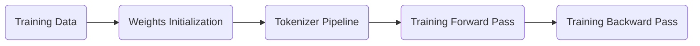

  
***  
  
GPT Training Process via Transformer ([State of GPT](https://karpathy.ai/))           [[>>]](/docs/llm-essential-backward-pass/#whereami)



***  
## Training Data  
   - Raw data of base model's training 
     - [Common Crawl](https://commoncrawl.org/)
     - [C4/C4.EN](https://github.com/google-research/text-to-text-transfer-transformer/tree/main#c4) (filtered from April 2019 snapshot of Common Crawl )
     - Github / [Wikipedia](http://wikipedia.org) / [ArXiv](https://arxiv.org/) / [Stack Exchange](https://stackexchange.com/)
     - Books 1/2/3 (digital books)  
    <br>  
   - Training Data of SFT model  
      Manually prepared by people  

      | Question | Answer |
      |:----:|:----:|
      | Prompt 1 | Expected Response 1 |
      | Prompt 2 | Expected Response 2 |
      | Prompt 3 | Expected Response 3 |
      | ... | ... |  
       
   - Training Data of RW model  
      Manually prepared and rank by people  

        | Question | Answer | Rank |
        |:----:|:----:|:----:|
        | **Prompt 1** | Response 1 from LLM | <\|Reward\|> |
        | **Prompt 1** | Response 2 from LLM | <\|Reward\|> |
        | **Prompt 1** | Response 3 from LLM | <\|Reward\|> |
        | ... | ... | ... |  

   

***  

## Weights Initialization


  ```mermaid
      graph LR
          A("`Token Embedding`")  --> B("`LayerNorm/RMSNorm`")  --> C("`Self-Attention`") --OR--> D("`FFN`") --> F("`LM Head`")
          G("`MoE`")
          C --OR--> G
          G --> F
          click A "#Weights-Token-Embedding"
          click B "#Weights-LayerNorm"
          click C "#Weights-Self-Attention"
          click D "#Weights-FFN"
          click F "#Weights-LM-Head"
          click G "#Weights-MoE"
  ```  

  1. **Token Embedding**  
    <a href="" id="Weights-Token-Embedding"></a>  
      <br>
      > Only one in a model!  

      Matrix Shape:  
      > [voca , d<sub>model</sub>]  

      (*voca for Vocabulary size*)
         
      e.g.  
      > V = 32000  
      d<sub>model</sub> = 512  

      Initialize via Truncated Normal Distribution:    

      > mean = 0  
      std = 0.02 or 
      $\frac{1}{\sqrt d_{model}}$   
      a: -2.0 * std  
      b: 2.0 * std  
      Data Range: [-0.04, 0.04]
     
      Example:  

      > $$
      \begin{pmatrix}
      v_{1} & d_{2} & d_{3} & ... & d_{512} \\
      v_{2} & 0.0123 & -0.0045 & ... & 0.0289 &\\
      ... & ... & ... & ...& ...\\
      v_{32000} & -0.0312 & 0.0008 & ... & 0.0156 &
      \end{pmatrix}
      $$  
      

      After initialize:  
        > $  
          mean \approx 0\\    
          std  \approx 0.02  
          $  
  
      <br>  
  2. **LayerNorm/RMSNorm**  
      <a href="" id="Weights-LayerNorm"></a> 
      > $γ,β \in R^{(d)} $ are learnable weights  
      *γ: Scale Param*  
      *β: Shift Param*

      Initial:  
      > γ = [1,1,...d]  
      β = [0,0,...d]  
      
      *Normally β is not needed in RMSNorm*  
      <br>    
  3.  **Self-Attention (W<sub>Q</sub> / W<sub>K</sub> / W<sub>V</sub> /  W<sub>output</sub>)**   
      <a href="" id="Weights-Self-Attention"></a>
      <br>
      > Each layer has one!  

      W<sub>Q</sub> / W<sub>K</sub> / W<sub>V</sub> Matrix Shape:  

      IF head = 1:  

      > [d<sub>model</sub>  , d<sub>model</sub>]   

      IF head>1:  
      > [d<sub>model</sub>  .  $\frac{d_{model} }{head}]$   


      W<sub>Q</sub> / W<sub>K</sub> / W<sub>V</sub>  Normal Initialization:  

      > W ~ N(0,σ<sup>2</sup>)  
          
      Above expression means: W follows a normal distribution with mean 0 and variance σ<sup>2</sup>  

        | Model | σ | Residual Scaling |
        |:----:|:----:|:----:|
        | GPT 3 | 0.02 |  ? | 
        | LLaMA 2 | 0.02 | ? | 
        | DeepSeek V3 | 0.006 | ? | 


      W<sub>Q</sub> / W<sub>K</sub> / W<sub>V</sub> example:  

      > $$
        \begin{pmatrix}
        d_{1} & d_{2} & d_{3} & ... & d_{512} \\
        d_{2} & 0.0610 & -0.0521 & ... & 0.0289 &\\
        ... & ... & ... & ...& ...\\
        d_{512} & -0.0312 & 0.0008 & ... & 0.0156 &
        \end{pmatrix}  
        $$   

      <br>  

      Residual Depth Scaling:  

      W<sub>Output</sub> Matrix Shape:     
      > [d<sub>model</sub>  , d<sub>model</sub>]  
      
      <br>  

      > σ<sub>residual</sub> = $\frac{σ}{\sqrt 2N}$    
      *N => number of transformer layers*  

      <br>  

      W<sub>output</sub> Initialization:  
      > W<sub>output</sub> ~ N(0,($\frac{σ}{\sqrt 2N}$)<sup>2</sup>) 

      <br>  

      <a href="" id="Weights-FFN"></a>
  4. **FFN (Feed Forward Network)**  
      (*Below shows the traditional linear FNN, you may refer to latest [SwiGLU](#swiglu)*)  
        ```mermaid
            graph LR
            G("`Attention
            (d<sub>model</sub>,d<sub>model</sub>)`")  --> 
            A("`W<sub>1</sub>
            (d<sub>model</sub>,d<sub>ffn</sub>)`")  --> B("`Activation`") --> D("`W<sub>2</sub>
            (d<sub>ffn</sub>,d<sub>model</sub>)
            `") --> E("`Output
            (d<sub>model</sub>,d<sub>model</sub>)`")
        ```   
        > Each layer has one!

      - Two linear transformation (W<sub>1</sub>, W<sub>2</sub>)   
    
          > d<sub>ffn</sub> = d<sub>model</sub>*4  

          <br>

          W<sub>1</sub>:  
          Matrix shape:     
          > [d<sub>model</sub>  , d<sub>ffn</sub>]  

          Initialization:  
          > W<sub>1</sub> ~ N(0,$\sqrt \frac{2}{d_{model}}$)   

          <br>

          W<sub>2</sub>:  
          Matrix shape:  
          > [d<sub>ffn</sub> , d<sub>model</sub>]  

          Initialization:    
          > W<sub>2</sub> ~ N(0,$\sqrt \frac{2}{d_{ff}}$) 

      - an activation in between  
        - ReLU/GELU

        <br> 

  5. **MoE (Mixture of Expert)**  
      <a href="" id="Weights-MoE"></a>
      ```mermaid
      flowchart LR
          
          G("`token x1
          (Hidden State x1,x2,x3,...)
          `")  --> 
          A("`Router
          (g<sub>i</sug>=x<sub>i</sub>W<sup>R</sup>)
          p<sub>i​</sub>=Softmax(g<sub>i</sub>)
          [0.05,0.02,0.38,...]
          `")  --> B("`Expert 1
          *(GPU 1)*
          `") & B1("`Expert 2
          *(GPU 6)*
          `") & B2("`Expert ...
          *(GPU ...)*
          `") &  B3("`Expert n
          *(GPU n)*
          `") --> D("`Routed Experts
            Top2(g1​)={E1,E3}
          `") --> E("`Expert 1
          *(FFN -> W<sub>1.1</sub>,W<sub>2.1</sub>,W<sub>3.1</sub>)*
          SwiGLU(?)
          `") & E1("`Expert 3
          *(FFN -> W<sub>1.3</sub>,W<sub>2.3</sub>,W<sub>3.3</sub>)*
          SwiGLU(?)
          `") --> F("`Combine
          y1​=p<sub>1</sub>E1​(x1​)+p<sub>3</sub>E3​(x1​)
          （y1,y2,y3,...）
          `") 
      ```   
      Weight initialization of FNN of each experts is same as normal FNN:
      > W~N(0, σ<sup>2</sup>)  
  <br>   

  6. **LM Head**   
      <a href="" id="Weights-LM-Head"></a>
      W<sub>LM</sub> is LM Head's weight and the shape of W<sub>LM</sub> is **$[voca , d]$**.  
      Used by logits like below:
      > logits = h*W<sub>LM</sub><sup>T</sup>  

      *h is hidden state*  
      About W<sub>LM</sub>:
      - [Independent] => initialize via W~N(0, σ<sup>2</sup>)(e.g. GPT-3, LLaMA)
      - [Share Weight with Token Embedding] => for saving parameter purpose?(e.g. Bert, GPT-2)  
  <br>   
 